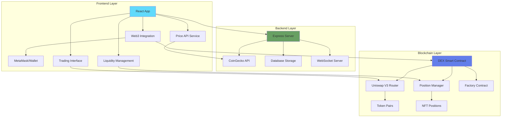
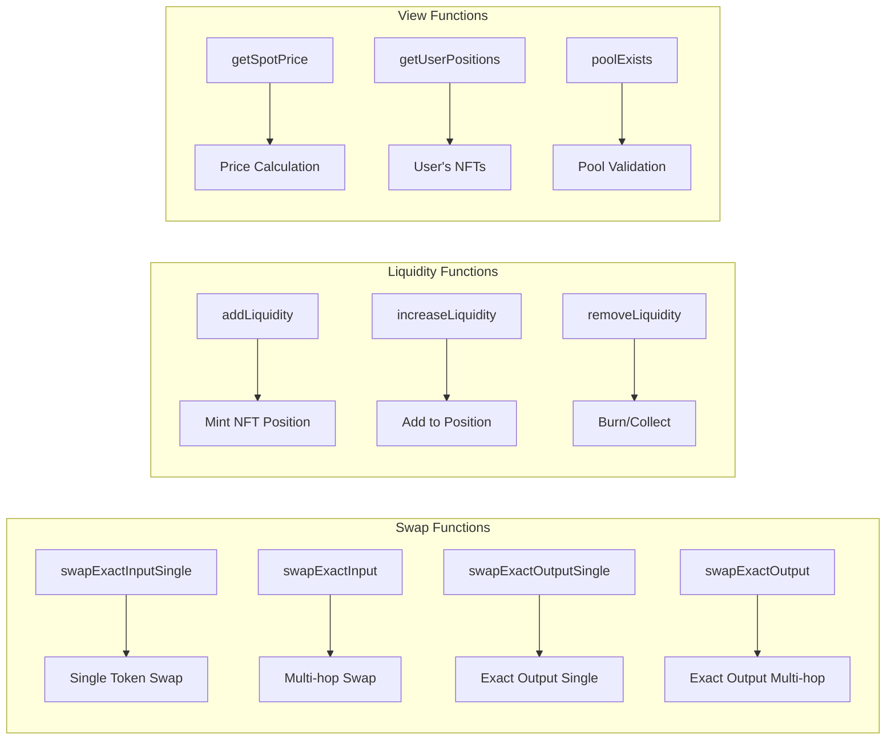
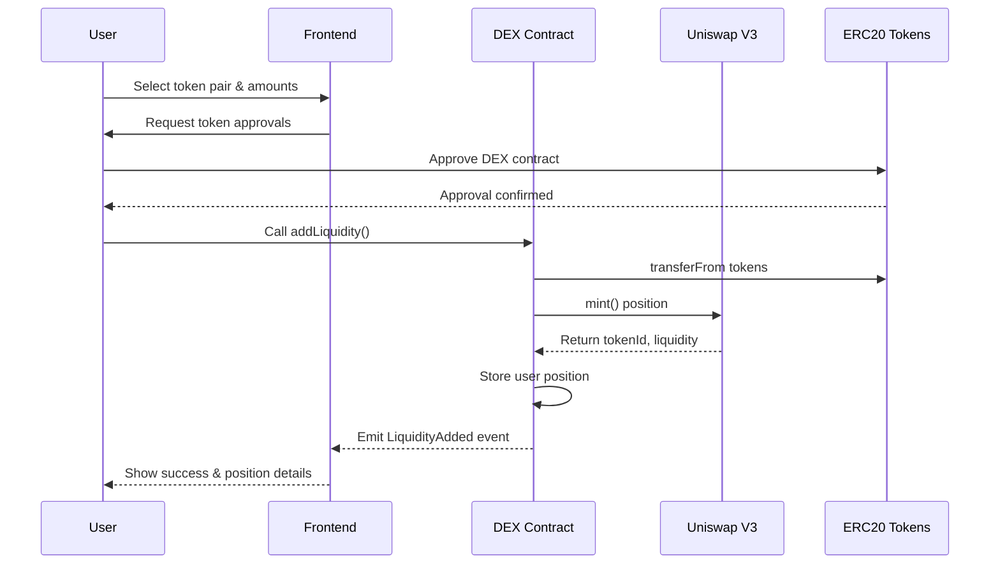
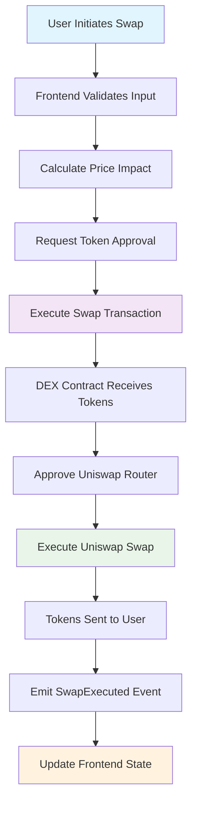

# Working Video


https://github.com/user-attachments/assets/29beae81-7057-4a94-b7e3-d748238c87fd


# RetroSwap - Decentralized Exchange (DEX) Full-Stack DApp

A modern, full-stack decentralized exchange built on Ethereum using Uniswap V3 protocols. RetroSwap enables seamless token swapping and liquidity provision with an intuitive user interface and robust smart contract architecture.


## 🏗️ Architecture Overview




## 🔧 Smart Contract Architecture

### DEX Contract (`contracts/DEX.sol`)

**Contract Address (Verified):** `0x04d21AB7ED0B2F3d1f5Db4235Af692AA24185668`

The main DEX contract integrates with Uniswap V3 to provide:

#### Core Features:
- **Token Swapping**: Exact input/output swaps with single and multi-hop routing
- **Liquidity Management**: Add, increase, and remove liquidity positions
- **Position Tracking**: NFT-based liquidity position management
- **Price Queries**: Real-time spot price calculations

#### Key Functions:



#### Security Features:
- **ReentrancyGuard**: Prevents reentrancy attacks
- **Access Control**: User-specific position tracking
- **Slippage Protection**: Minimum amount parameters
- **Deadline Protection**: Time-based transaction validity

### Interface Integration:

```solidity
interface Dependencies {
    IERC20           // Token transfers and approvals
    IERC721          // NFT position handling
    INonfungiblePositionManager  // Uniswap V3 liquidity
    IUniswapV3Factory           // Pool creation and queries
    IUniswapV3Pool             // Pool state queries
    ISwapRouter                // Token swapping
}
```

## 🎨 Frontend Application

### Technology Stack:
- **React 18** with TypeScript
- **Vite** for build tooling
- **TailwindCSS** for styling
- **Ethers.js** for blockchain interaction
- **React Query** for data fetching
- **Framer Motion** for animations

### Key Components:

#### 1. Trading Interface
```typescript
// Swap component with real-time price updates
const SwapInterface = () => {
  const [tokenIn, setTokenIn] = useState();
  const [tokenOut, setTokenOut] = useState();
  const [amountIn, setAmountIn] = useState('');
  
  // Real-time price fetching
  const { data: prices } = useQuery({
    queryKey: ['token-prices'],
    queryFn: () => coinGeckoService.getSupportedTokenPrices(),
    refetchInterval: 30000 // 30 seconds
  });
};
```

#### 2. Liquidity Management
```typescript
// Liquidity position management
const LiquidityPool = () => {
  const addLiquidity = async (params: AddLiquidityParams) => {
    const tx = await dexContract.addLiquidity(
      params.token0,
      params.token1,
      params.fee,
      params.tickLower,
      params.tickUpper,
      params.amount0Desired,
      params.amount1Desired,
      params.amount0Min,
      params.amount1Min
    );
    return tx.wait();
  };
};
```

#### 3. Web3 Integration
```typescript
// Wallet connection and contract interaction
const Web3Provider = () => {
  const [provider, setProvider] = useState();
  const [signer, setSigner] = useState();
  const [contract, setContract] = useState();
  
  const connectWallet = async () => {
    if (window.ethereum) {
      const provider = new ethers.BrowserProvider(window.ethereum);
      const signer = await provider.getSigner();
      const contract = new ethers.Contract(DEX_ADDRESS, DEX_ABI, signer);
      
      setProvider(provider);
      setSigner(signer);
      setContract(contract);
    }
  };
};
```

## 🔗 Backend API Services

### Express.js Server with TypeScript

#### API Endpoints:

```typescript
// Price data endpoints
app.get('/api/coingecko/simple/price', async (req, res) => {
  // Fetch real-time token prices with caching
  // Includes fallback data for reliability
});

app.get('/api/coingecko/coins/markets', async (req, res) => {
  // Market data for token listings
});

// Transaction tracking
app.post('/api/swaps', async (req, res) => {
  // Store swap transaction data
});

app.get('/api/swaps/:userAddress', async (req, res) => {
  // Retrieve user's swap history
});

// Liquidity position tracking
app.post('/api/positions', async (req, res) => {
  // Store liquidity position data
});

app.get('/api/positions/:userAddress', async (req, res) => {
  // Retrieve user's liquidity positions
});
```

#### Features:
- **Rate Limiting**: CoinGecko API with intelligent caching
- **Error Handling**: Graceful fallbacks for API failures
- **Data Persistence**: In-memory storage with database interface
- **CORS Support**: Cross-origin request handling
- **Environment Configuration**: Development and production modes

### CoinGecko Integration:

```typescript
export class CoinGeckoService {
  async getSupportedTokenPrices(): Promise {
    const tokenIds = ['ethereum', 'bitcoin', 'usd-coin', 'dai', 'tether'];
    const prices = await this.getTokenPrices(tokenIds);
    
    return {
      ETH: { price: prices.ethereum?.usd || 0, change24h: prices.ethereum?.usd_24h_change || 0 },
      WETH: { price: prices.ethereum?.usd || 0, change24h: prices.ethereum?.usd_24h_change || 0 },
      BTC: { price: prices.bitcoin?.usd || 0, change24h: prices.bitcoin?.usd_24h_change || 0 },
      // ... additional token mappings
    };
  }
}
```

## 💧 Liquidity Management

### Position Creation Flow:



### Liquidity Features:
- **Range Orders**: Concentrated liquidity within price ranges
- **NFT Positions**: Each position represented as unique NFT
- **Flexible Management**: Increase, decrease, or close positions
- **Fee Collection**: Automatic fee accumulation and collection
- **Position Tracking**: User-specific position management

## ⚡ Swap Functionality

### Swap Types Supported:

#### 1. Exact Input Single
```solidity
function swapExactInputSingle(
    address tokenIn,
    address tokenOut,
    uint24 fee,
    uint256 amountIn,
    uint256 amountOutMinimum
) external nonReentrant returns (uint256 amountOut)
```

#### 2. Exact Input Multi-hop
```solidity
function swapExactInput(
    address tokenIn,
    address tokenMid,
    address tokenOut,
    uint24 fee1,
    uint24 fee2,
    uint256 amountIn,
    uint256 amountOutMinimum
) external nonReentrant returns (uint256 amountOut)
```

### Swap Execution Flow:



## 🧪 Testing Framework

### Smart Contract Tests:

```
// DexTest.test.sol
forge test test/DexTest.test.sol --fork-url $MAINNET_RPC_URL
```


```
//SepoliaTest.test.sol
forge test test/SepoliaTest.test.sol --fork-url $SEPOLIA_RPC_URL

```


 


## 🚀 Deployment & Setup

### Prerequisites:
- Node.js 18+
- MetaMask or compatible Web3 wallet
- Ethereum testnet ETH (for testing)

### Local Development:

```bash
# Clone the repository
git clone https://github.com/yourusername/retroswap.git
cd retroswap

# Install frontend dependencies
cd frontend
npm install

# Install backend dependencies
cd ../backend
npm install

# Install Foundry for smart contracts
curl -L https://foundry.paradigm.xyz | bash
foundryup

# Install smart contract dependencies
forge install OpenZeppelin/openzeppelin-contracts --no-commit
forge install foundry-rs/forge-std --no-commit
```

### Environment Configuration:

```bash
# Frontend (.env)
VITE_DEX_CONTRACT_ADDRESS=0x04d21AB7ED0B2F3d1f5Db4235Af692AA24185668
VITE_CHAIN_ID=11155111
VITE_RPC_URL=https://sepolia.infura.io/v3/YOUR_PROJECT_ID

# Backend (.env)
PORT=5000
NODE_ENV=development
COINGECKO_API_KEY=your_api_key_here
```

### Running the Application:

```bash
# Start backend server
cd backend
npm run dev

# Start frontend development server
cd frontend
npm run dev

# Build and deploy smart contracts
cd backend
forge build
forge script script/Deploy.s.sol --rpc-url $RPC_URL --private-key $PRIVATE_KEY --broadcast
```

## 📊 Monitoring & Analytics

### Transaction Events:
- **SwapExecuted**: Token swap completions
- **LiquidityAdded**: New liquidity positions
- **LiquidityRemoved**: Position closures

### Metrics Tracking:
- Total trading volume
- Unique users
- Liquidity depth
- Price impact analysis
- Gas usage optimization

## 🔐 Security Considerations

### Smart Contract Security:
- **Reentrancy Protection**: All external calls protected
- **Access Control**: Position ownership validation  
- **Slippage Protection**: Minimum output enforcement
- **Deadline Validation**: Time-bounded transactions

### Frontend Security:
- **Input Validation**: All user inputs sanitized
- **Transaction Simulation**: Pre-execution validation
- **Error Handling**: Graceful failure management
- **Private Key Security**: Never stored locally

## 🛣️ Roadmap

### Phase 1 (Current):
- ✅ Basic swap functionality
- ✅ Liquidity management
- ✅ Price data integration
- ✅ Web3 wallet integration

### Phase 2 (Upcoming):
- 🔄 Advanced trading features (limit orders)
- 🔄 Portfolio tracking
- 🔄 Yield farming integration
- 🔄 Mobile application

### Phase 3 (Future):
- 🔄 Cross-chain support
- 🔄 Governance token
- 🔄 Advanced analytics
- 🔄 Institutional features

## 📄 License

This project is licensed under the MIT License - see the [LICENSE](LICENSE) file for details.

## 🤝 Contributing

Contributions are welcome! Please read our [Contributing Guidelines](CONTRIBUTING.md) and submit pull requests to our development branch.

## 📞 Support

For support and questions:
- Create an issue on GitHub
- Can contact on linkedin
  

**RetroSwap** - Bringing modern DeFi to everyone 🚀 Built by Alchemist with  💖
